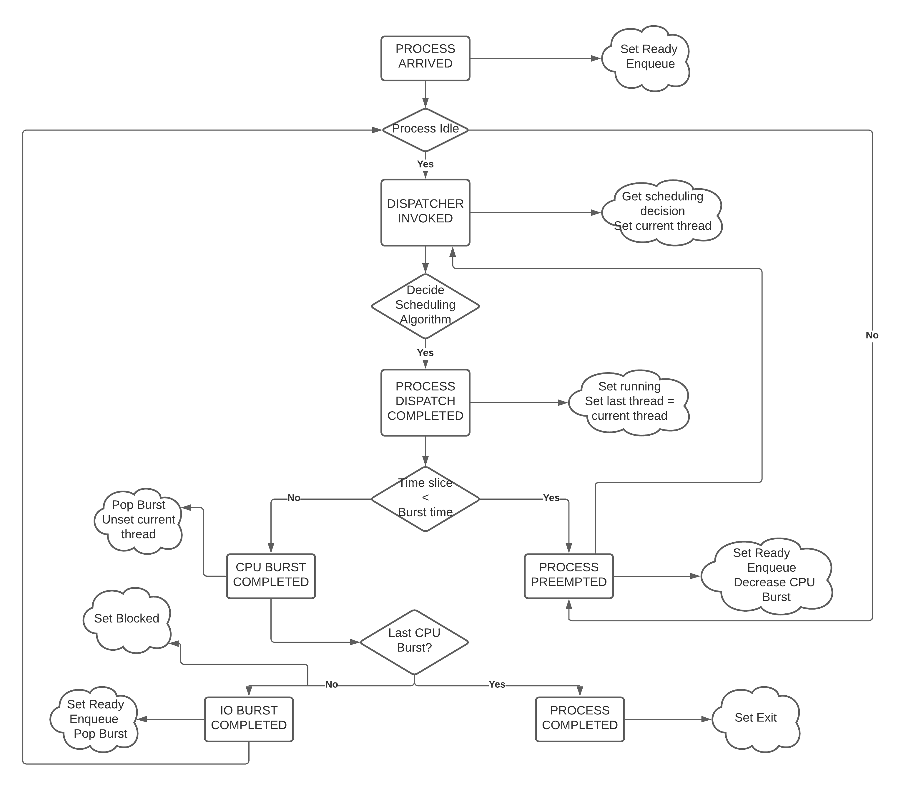

============================================
CSCI-442 Project 4: CPU Scheduling Simulator
============================================

:Due: See Canvas for the due dates of each deliverable.

.. important::

   * You'll want to read this **entire document** before beginning the project.  Please ask any questions you have on Piazza, but only if this README does not answer your question.
   * Finally, be sure to start early.  If you wait until a few days before the due date, you are unlikely to finish in time.

1. Introduction
===============

The goal of this project is to implement many of the scheduling algorithms discussed in class in a discrete-
event simulator. Additionally, at the end of execution, your program will calculate and display several
performance criteria from the simulation.

Since this is a large project, you should note the following:

1. You are given a **LOT** of starter code, which implements the simulation for you and nicely sets up 
   what you are required to implement.

        - You will gain familarity with working on a large, existing code base using modern C++ principles.

        - Part of the project is simply being comfortable with understanding how to work with large
          amounts of code you did not write.

        - However, if you prefer reinventing the wheel and overall making your life more difficult,
          you do *not* have to use the starter provided.
          But note that you are adding a good 20+ hours of work to yourself by not using it, and only limited
          TA support will be available for this.

2. This project is split into two deliverables to discourage procrastination. 

2. Project Requirements
=======================

You will create a program called ``cpu-sim``, which simulates a variety of possibly multi-threaded processes
using a specified scheduling algorithm. For instance::

        prompt> ./cpu-sim -a FCFS tests/input/input-1 

...would simulate the processes given in ``tests/input/input-1`` using the FCFS scheduling algorithm.
See **the Appendix** for the full list of options. Note that the starter code parses these for you.

.. raw:: pdf

        PageBreak

Deliverable 1
-------------

The following is required for deliverable 1:

1. All functionality present in the starter code

        * While technically optional, it is highly recommended you use the starter code.

        * Expect to spend 20+ hours of *additional work* to implement this functionality along with
          limited TA support should you choose this route.

2. Calculation of the necessary performance metrics

3. The following scheduling algorithms implemented:

        * FCFS

        * SPN

        * RR

Deliverable 2
-------------

1. All functionality required in Deliverable 1

2. The following additional scheduling algorithms:

        * PRIORITY
        * MLFQ

.. warning::

        The algorithms required in Deliverable 2 are **MUCH** more complicated than those in Deliverable 1. 
        Expect to spend more time on Deliverable 2 than Deliverable 1.

3. Various Project Specifications
==================================

The following sections contain all the information you need to complete this project. 

- If you have a question about what to do, you can likely find it in this (massive) section

Simulation Information
----------------------

(This is implemented for you in the starter code **BUT** you should still read it,
or the other sections may not make sense)

The simulation is over a computer with the following attributes:

1. There is a single CPU, so only one task can be running at a time.

2. There are an infinite number of I/O devices, so any number of processes can be blocked on I/O at the same time.

3. Processes consist of one or more kernel-level threads (KLTs).

4. Tasks can exist in one of five states:

        - NEW
        - READY
        - RUNNING
        - BLOCKED
        - EXIT

5. Scheduling tasks requires a non-zero amount of OS overhead:

        - If the previously executed thread belongs to a different process than the new thread, a
          full *process switch* occurs. This is also the case for the first thread being executed.

        - If the previously executed thread belongs to the same process as the new thread being dispatched,
          a cheaper *thread switch* is done.

                - A full process switch includes any work required by a thread switch.

        - Running the scheduler (dispatcher) also requires a certain amount of overhead.

6. Threads, processes, and dispatch overhead are specified via the input file

7. Each thread requires a sequence of CPU and I/O bursts of varying lengths as specified by the input file.

        - You can think of "bursts" as an observation of the task's behavior: a task wanting needing to use
          the CPU for 10 ms, then read a file (which takes 500 ms), then use the CPU for another 10 ms;
          would be composed of 3 bursts:

                a. A CPU burst of 10 ms

                b. An IO burst of 500 ms

                c. A CPU burst of 10 ms

        - Note that all tasks will end with a CPU burst.

8. Processes have an associated priority, specified as part of the file. Each thread in a process has the same priority as its parent process.

        - 0: SYSTEM (highest priority)
        - 1: INTERACTIVE
        - 2: NORMAL
        - 3: BATCH (lowest priority)

9. All processes have a distinct process ID, specified as part of the file. Thread IDs are unique only within the context of their owning process (so the first thread in every process has an ID of 0).

10. Overhead is incurred only when dispatching a thread (transitioning it from READY to RUNNING); all other OS actions require zero OS overhead. For example, adding a thread to a ready queue or initiating I/O are both ”free”.

11. Threads for a given process can arrive at any time, even if some other process is currently running (i.e., some external entity—not the CPU—is responsible for creating threads).

12. Tasks are executed on the CPU. For our purposes, a task is either:

       a. A single-threaded process

       b. A single thread of a multi-threaded process.

       - Note this means a "task" is synonymous with a "thread" in this project,
         since we do not care about kernel workers.
         Thus, the two are used interchangably throughout this writeup.

Scheduling Algorithms
---------------------

All scheduling algorithms required are listed below. The algoritms below (FCFS, RR, SPN, PRIORITY, and MLFQ) are described on the slides shown
in class.

(1) First Come, First Served (FCFS)
~~~~~~~~~~~~~~~~~~~~~~~~~~~~~~~~~~~

* Tasks are scheduled in the order they are added to the ready queue

* Tasks run until their CPU burst is completed.

...which implies:

1. There is no preemption in this algorithm 

2. All process priorities are treated as equal.

(2) Shortest Process Next (SPN)
~~~~~~~~~~~~~~~~~~~~~~~~~~~~~~~

* Tasks are scheduled in order (from smallest to largest) of their next CPU burst.

        * While this requires future knowledge and thus is impossible to implement in the "RealWorld",
          in a simulation you know this exact value.

* Tasks run until their CPU burst is completed.

...which implies:

1. There is no preemption in this algorithm 

2. All process priorities are treated as equal.

* Priority queues in C++'s STL (Standard Library) are not always accurate. A Priority queue sorts it's entries
  based on a given priority. If this priority is the same, the order of these matching entries can't be guarenteed. 
  To solve this we provide a much better implementation for you in 
  ``src/utilities/stable_priority_queue/``, which is highly recommended for you to use.
  

(3) Round Robin (RR)
~~~~~~~~~~~~~~~~~~~~

* Tasks are scheduled in the order they are added to the ready queue

* Tasks may be preempted if their CPU burst length is greater than the *time slice*

* In the event of a preemption:

        a. The task is removed from the CPU

        b. Its CPU burst length is updated to reflect the fact that it got some CPU time (how much?)

        c. The task is added to the back of the ready queue.

...which implies:

1. There **IS** preemption in this algorithm.

2. All process priorities are treated as equal.

(4) Priority
~~~~~~~~~~~~

* Tasks priorities have the following order:

        a. ``SYSTEM`` (highest)

        b. ``INTERACTIVE``

        c. ``NORMAL``

        d. ``BATCH``  (lowest)

* Tasks *of the same priority* are scheduled in the order they are added to the ready queue

* Tasks *of different* priorities should follow the order given above (i.e., *all* ``SYSTEM`` 
  tasks in the ready queue should be executed before *ANY* ``INTERACTIVE`` tasks, and so forth)

* Tasks run until their CPU burst is completed.

...which implies:

1. There is no preemption in this algorithm 

2. Process priorities are NOT to be ignored.

*Implementation Hint:*

- ...As mentioned before, the standard library priority queue is not deterministic when multiple entries share the same priority.
  We highly recommend using the provided stable_priority_queue in ``src/utilities/stable_priority_queue`` as it will also be useful
  for MLFQ.
  

(5) Multi-Level Feedback Queues (MLFQ)
~~~~~~~~~~~~~~~~~~~~~~~~~~~~~~~~~~~~~~

...called Feedback in the slides

* There are ``n`` queues, numbered ``0 ... n-1``
        
        - For this project, ``n = 10``  

* The priority of a queue is given by: ``n - <queue number>``

        - This means lower numbered queues have higher priority.

        - E.g., queue 0 has priority ``n``, queue 3 has priority ``n - 3``, and so forth

* Tasks in lower-numbered (i.e., higher-priority) queues should be scheduled before higher-numbered queues

        - E.g., *all* tasks in queue 0 should be scheduled before *any* in queue 1, etc.

* When a task enters the system, it should be placed in the topmost queue (queue ``0``)

.. raw:: pdf

        PageBreak

* The time slice a task is given is based off of its queue number.

        - Tasks in queue 0 have ``|time slice| = 1``

        - Tasks in queue 1 have ``|time slice| = 2``

        - Tasks in queue 2 have ``|time slice| = 4``

        - ...

        - Tasks in queue ``n`` have ``|time slice| = 2^n``

                - Note: This is pseudocode. ``^`` in C++ is a bitwise XOR, you want exponentiation. 

* Once a task uses up its time allotment at a given level (regardless of how many times it has given
  up the CPU), it moves down one queue.

* Tasks *within* the same queue should be scheduled using round-robin, with the following addendum:
  process priorities *must* be respected.

        - Thus, *all* tasks with a higher priority (e.g., ``SYSTEM``) should be scheduled before
          *any* lower priority tasks (e.g., ``BATCH``) **in the same queue**.

        - This is the only place process priorities matter in this algorithm. 

*Implementation Hint*: 

- You should use an array of priorities queues

- Doing the Priority algorithm before MLFQ would be helpful for understanding priority queues.

Required Logging
----------------

To aid in debugging (and grading!), you are **required** to log certain pieces of information
about your algorithm. Specifically, you **must** fill the ``SchedulingDecision::explanation`` field
with one of the following messages, based on the algorithm:

1. For **ALL** algorithms, if the ready queue is empty when the ``get_next_thread()`` function is called,
   the explanation must be::

        No threads available for scheduling.

2. If the ready queue is *not* empty (thus a thread was selected for scheduling), the explanation differs
   based on the algorithm:

        a. FCFS::

                Selected from X threads. Will run to completion of burst.

        b. SPN::

                Selected from X threads. Will run to completion of burst.

        c. RR:: 

                Selected from X threads. Will run for at most Y ticks.

        d. Priority::

                [S: u I: u N: u B: u] -> [S: v I: v N: v B: v]. Will to completion of burst.        

        e. MLFQ::

                Selected from queue Z (priority = P, runtime = R). Will run for at most Y ticks. 

* ``X`` is the *total* number of ``Ready`` threads

* ``Y`` is the length of the time slice

* ``Z`` is the MLFQ queue *number*

* ``R`` is the amount of CPU time the task has accumulated *while in the current MLFQ queue*

* ``V`` is the value of ``vruntime`` for the selected thread.

* ``P`` is the *process* priority.

* ``u`` is the number of threads of that priority (``S = SYSTEM``, etc.) *before* the chosen thread is removed.

* ``v`` is the number of threads of that priority (``S = SYSTEM``, etc.) AFTER the chosen thread is removed.

Lastly, you may find ``utilities/fmt/`` to be useful in making these messages.

.. raw:: pdf

        PageBreak

Performance Metrics
-------------------

You need to calculate the following performance metrics:

1. Number of threads per process priority

2. Average turnaround time per process priority 

3. Average response time per process priority

4. Total elapsed time

5. Total service time

6. Total I/O time

7. Total time spent running the scheduler

8. Total idle time

9. CPU utilization

10. CPU efficiency

See the ``SystemStatistics`` class and ``Simulation::calculate_statistics()`` for more information.

Tips
----

1: Start small, and get things working incrementally
~~~~~~~~~~~~~~~~~~~~~~~~~~~~~~~~~~~~~~~~~~~~~~~~~~~~

You are given a *ton* of starter code. While it may be tempting to "dive right in and start hacking",
you are likely to end up with broken code that you don't understand. Instead, follow these guidelines:

- The ``src/types/`` folder contains the base classes this entire project is built on. Maybe take a look
  at say, what the ``Thread`` and ``SchedulingDecision`` classes contain?

- Your algorithm implementations will go in ``src/algorithms/``. Note that a skeleton for ``fcfs`` is given,
  which is a class (``FCFSScheduler``) that *inherits* from ``Scheduler``. Maybe take a look
  at both classes (``.hpp`` and ``.cpp``), and read the code comments to get a feel for what functions
  need to be implemented?

        - You should follow this same setup in your remaining algorithms, for which only
          the file structure is given.

- While the simulation itself is given to you in ``src/simulation/simulation.cpp``, **you will need to
  modify this file** to add your algorithms as you implement them (see the FCFS example) along with
  calculating the required statistics.

- This is a modern C++ codebase, which uses language features you may not have seen in C++ before, such as:

        - Smart pointers (!!)

        - Inheritance and ``this``

        - Enumerated types

        - Operator overloading

        - **NOT** having ``using namespace std`` at the top of every file

        - If "it's been awhile" since you have used these features in C++, you will find
          reading the documentation to be quite helpful.

- Lastly, there are several TODOs scattered throughout the starter code to guide you on your way. You should
  make sure to implement all of them.

This is a large project, if you do it all at once you will likely end up with minor bugs that are 
nearly impossible to fix. Start small and plan before you code.

2: Test often
~~~~~~~~~~~~~

To help you test your project, we have provided a script ``test-my-work.sh`` to run your
code on the provided input/output files. 

To run this script, first::

        chmod +x test-my-work.sh

and then::

        ./test-my-work.sh

If your output does not match the expected for a specific input/output/parameter combination,
the script will stop and give your more details. Otherwise, it will print a ``Test passed!`` message.

3: Keep old versions around
~~~~~~~~~~~~~~~~~~~~~~~~~~~

Keep copies of old versions of your program around, as you may introduce bugs and not be
able to easily undo them. 

- Use **git** for this. This project is already a Git repository, so take advantage
  of all the version control features git provides!

.. raw:: pdf

        PageBreak

5. Logistics 
============

General Requirements
--------------------

- Your code must be written in C++ and compile using ``make`` on Isengard.

- Your simulation should be able to be executed by typing ``./cpu-sim`` in the root directory of your repository.

- Your project must be memory safe, and have a zero exit status if no errors are encountered.

- Your project must not execute external programs or use network resources. 

Collaboration Policy
--------------------

Please see the syllabus for the course plagarism policies.

This is an **team project**.  Plagarism cases will be punished
harshly according to school policies.

Please do keep any Git repos private, even after you finish this
course.  This will keep the project fun for future students!

Submitting Your Project
-----------------------

Submission and grading of your project will be handled via **Gradescope**.

1. Create the submission file using the provided ``make-submission`` script::

        prompt> ./make-submission

2. This will create a ``.zip`` file named ``$USER-submission`` (e.g., for me, this would be named ``lhenke-submission.zip``).

3. Submit this ``.zip`` file to Gradescope. You will get a confirmation email if you did this correctly.

You can re-submit as many times as you want before the due date, but note the project will not be graded until
a few days after the due date, **NOT** on-submission (similar to Canvas).

.. warning::
        You are **REQUIRED** to use ``make-submission`` to form the ``.zip`` file. Failure to do so
        may cause your program to not compile on Gradescope. A penalty to your grade will be applied
        if you need to resubmit due to compilation issues stemming from not using this script.

.. raw:: pdf

        PageBreak

Appendices
==========

Everything listed in these appendices **is handled for you in the starter code**. But incase you need
more information about some feature of the project, this information is given. 

Warning: Here Be Dragons.

1 Command Line Parsing
----------------------

Your simulation must support invocation in the format specified below, including the following command line flags:

.. code-block:: 

   ./cpu-sim [flags] [simulation_file]
   
   -h, --help
      Print a help message on how to use the program.
      
   -m, --metrics
      If set, output general metrics for the simulation.
      
   -s, --time_slice [positive integer]
      The time slice for preemptive algorithms.
      
   -t, --per_thread
      If set, outputs per-thread metrics at the end of the simulation.
      
   -v, --verbose
      If set, outputs all state transitions and scheduling choices.
      
   -a, --algorithm <algorithm>
      The scheduling algorithm to use. Valid values are:
         FCFS: first come, first served (default)
         RR: round robin scheduling
         
Users should be able to pass any flags together, in any order, provided that:

- If the ``--help`` flag is set, a help message is printed to ``stdout`` and the program immediately exits.
- If ``--time_slice`` is set, it must be followed immediately by a positive integer.
- If ``--algorithm`` is set, it must be followed immediately by an algorithm choice.
- If ``--algorithm`` is not set, your program shall default to using FCFS as its scheduling algorithm.
- If a filename is not provided, the program shall read in from ``stdin``.

Any improper command line input should cause your program to print the help message and then immediately exit. Information on proper output formatting can be found in Section 9.

You are strongly encouraged to use the getopt family of functions to perform the command line parsing. Information on getopt can be found here: http://man7.org/linux/man-pages/man3/getopt.3.html

2 Next-Event Simulation
-----------------------

This simulation follows the next-event pattern. At any given time, the simulation is in a single state. The simulation state can only change at event times, where an event is defined as an occurrence that may change the state of the system.

Since the simulation state only changes at an event, the ”clock” can be advanced to the next scheduled event–regardless of whether the next event is 1 or 1,000,000 time units in the future. This is why it is called a ”next-event” simulation model. In our case, time is measured in simple ”units”. Your simulation must support the following event types:

- **THREAD ARRIVED**: A thread has been created in the system.
- **THREAD DISPATCH COMPLETED**: A thread switch has completed, allowing a new thread to start executing on the CPU.
- **PROCESS DISPATCH COMPLETED**: A process switch has completed, allowing a new thread to start executing on the CPU.
- **CPU BURST COMPLETED**: A thread has finished one of its CPU bursts and has initiated an I/O request.
- **IO BURST COMPLETED**: A thread has finished one of its I/O bursts and is once again ready to be executed.
- **THREAD COMPLETED**: A thread has finished the last of its CPU bursts.
- **THREAD PREEMPTED**: A thread has been preempted during execution of one of its CPU bursts.
- **DISPATCHER INVOKED**: The OS dispatcher routine has been invoked to determine the next thread to be run on the CPU

The main loop of the simulation consists of processing the next event, perhaps adding more future events in the queue as a result, advancing the clock (by taking the next scheduled event from the front of the event queue), and so on until all threads have terminated. See Figure 1 for an illustration of the event simulation. Rounded rectangles indicate functions that you will need to implement to handle the associated event types.

   
   Figure 1: A high level illustration of the next-event simulation. In the starter code, all of this functionality is to be implemented within the Simulation class. Rounded rectangles represent functions, while diamonds are decisions that lead to different actions being taken. For example, if the event type is determined to be THREAD ARRIVED, then the handle thread arrived(event) function should be called.

3.1 Event Queue
~~~~~~~~~~~~~~~

Events are scheduled via an event queue. The event queue is a priority queue that contains future events; the priority of each item in the queue corresponds to its scheduled time, where the event with the highest ”priority” (at the front of the queue) is the one that will happen next.

To determine the next event to handle, a priority queue is used to sort the events. For this project, the event queue should sort based on these criteria:

- The time the event occurs. The earliest time comes first (time 3 comes before time 12).

- If two events have the time, then the tie breaker should be the events’ number: as each new event is created, it should be assigned a number representing how many events have been created. For example, the first event in the simulation should be given the number 0, the second the number 1, and so on. The earliest number should come first (event number 6 comes before event number 7).

3 Simulation File Format
------------------------
The simulation file specifies a complete specification of scheduling scenario. It’s format is as follows:

.. code-block::

   num_processes thread_switch_overhead process_switch_overhead
   
   process_id process_type num_threads    // Process IDs are unique
   thread_0_arrival_time num_cpu_bursts
   cpu_time io_time
   cpu_time io_time
   ...                                    // Repeat for num_cpu_bursts
   cpu_time

   thread_1_arrival_time num_cpu_bursts
   cpu_time io_time
   cpu_time io_time
   ...                                    // Repeat for num_cpu_bursts
   cpu_time
   
   ...                                    // Repeat for the number of threads

   process_id process_type num_threads    // We are now reading in the next process
   thread_0_arrival_time num_cpu_bursts
   cpu_time io_time
   
   cpu_time io_time
   ...                                    // Repeat for num_cpu_bursts
   cpu_time

   thread_1_arrival_time num_cpu_bursts
   cpu_time io_time
   cpu_time io_time
   ...                                    // Repeat for num_cpu_bursts
   cpu_time

   ...                                    // Repeat for the number of threads
   
   ...                                    // Keep reading until EOF is reached
   
Here is a commented example. The comments will not be in an actual simulation file.

.. code-block:: 

   2 3 7    // 2 processes , thread overhead is 3, process overhead is 7
   
   0 1 2    // Process 0, Priority is INTERACTIVE , it contains 2 threads
   0 3      // The first thread arrives at time 0 and has 3 bursts
   4 5      // The first pair of bursts : CPU is 4, IO is 5
   3 6      // The second pair of bursts : CPU is 3, IO is 6
   1        // The last CPU burst has a length of 1

   1 2      // The second thread in Process 0 arrives at time 1 and has 2 bursts
   2 2      // The first pair of bursts : CPU is 2, IO is 2
   7        // The last CPU burst has a length of 7

   1 0 3    // Process 1, priority is SYSTEM , it contains 3 threads
   5 3      // The first thread arrives at time 5 and has 3 bursts
   4 1      // The first pair of bursts : CPU is 4, IO is 1
   2 2      // The second pair of bursts : CPU is 2, IO is 2
   2        // The last CPU burst has a length of 2

   6 2      // The second thread arrives at time 6 and has 2 bursts
   2 2      // The first pair of bursts : CPU is 2, IO is 2
   3        // The last CPU burst has a length of 3

   7 5      // The third thread arrives at time 7 and has 5 bursts
   5 7      // CPU burst of 5 and IO of 7
   2 1      // CPU burst of 2 and IO of 1
   8 1      // CPU burst of 8 and IO of 1
   5 7      // CPU burst of 5 and IO of 7
   3        // The last CPU burst has a length of 3

4 Output Formatting
-------------------

For efficient and fair grading, it is vital that your simulation outputs information in a well-defined way. The starter code provides functionality for printing information, and it is strongly encouraged that you use it. The information that your simulation prints is dependent on the flags that the user has input, and in the following sections we describe what should be printed for each flag.

4.1 No flags input
~~~~~~~~~~~~~~~~~~

If the user has not input any flags to your program, you should only output the following:

``SIMULATION COMPLETED!``

4.2 --metrics
~~~~~~~~~~~~~

When the metrics flag has been passed to your simulation, it should output the following information:

.. code-block::
   
   SIMULATION COMPLETED !

   SYSTEM THREADS :
      Total Count : 3
      Avg . response time : 23.33
      Avg . turnaround time : 94.67
   
   INTERACTIVE THREADS :
      Total Count : 2
      Avg . response time : 10.00
      Avg . turnaround time : 73.50

   NORMAL THREADS :
      Total Count : 0
      Avg . response time : 0.00
      Avg . turnaround time : 0.00

   BATCH THREADS :
      Total Count : 0
      Avg . response time : 0.00
      Avg . turnaround time : 0.00

   Total elapsed time : 130
   Total service time : 53
   Total I/O time : 34
   Total dispatch time : 69
   Total idle time : 8

   CPU utilization : 93.85%
   CPU efficiency : 40.77%

4.3 --per thread
~~~~~~~~~~~~~~~~

When the per thread flag has been passed to your simulation, it should output information about each of the threads.

.. code-block::

   SIMULATION COMPLETED !

   Process 0 [INTERACTIVE]:
      Thread   0:    ARR : 0      CPU : 8     I/O: 11     TRT: 88        END: 88
      Thread   1:    ARR : 1      CPU : 9     I/O: 2      TRT: 59        END: 60

   Process 1 [SYSTEM]:
      Thread   0:    ARR : 5      CPU : 8     I/O: 3      TRT : 92       END: 97
      Thread   1:    ARR : 6      CPU : 5     I/O: 2      TRT : 69       END: 75
      Thread   2:    ARR : 7      CPU : 23    I/O: 16     TRT : 123      END: 130
   
4.4 --verbose
~~~~~~~~~~~~~

When the verbose flag has been passed to your simulation, it should output, at each state transition, information about the state transition that is occurring. It should be outputting this information ”on the fly”.

.. code-block::

   At time 0:
      THREAD_ARRIVED
      Thread 0 in process 0 [INTERACTIVE]
      Transitioned from NEW to READY

   At time 0:
      DISPATCHER_INVOKED
      Thread 0 in process 0 [INTERACTIVE]
      Selected from 1 threads . Will run to completion of burst.
      
This continues until the end of the simulation:

.. code-block::

   At time 127:
      THREAD_DISPATCH_COMPLETED
      Thread 2 in process 1 [ SYSTEM ]
      Transitioned from READY to RUNNING

   At time 130:
      THREAD_COMPLETED
      Thread 2 in process 1 [ SYSTEM ]
      Transitioned from RUNNING to EXIT

   SIMULATION COMPLETED !

4.5 Multiple Flags
~~~~~~~~~~~~~~~~~~

If multiple flags are input, all should be printed, in this order:

1. The verbose information.
2. ``SIMULATION COMPLETED!``
3. Per thread metrics.
4. General simulation metrics.

4.6 Recommendations
~~~~~~~~~~~~~~~~~~~
Again, it is highly recommended that you take advantage of the existing logger functionality!

5 Grading
~~~~~~~~~~~~~~~~~~~

The output of your program will be compared line by line to the expected output using sdiff.

Unlike previous projects, there is partial credit on tests for this project due to the length of the output. 
The grade for a given test is the number of lines matched divided by the total number of lines in the expected file. This does mean
that matching our syntax on output is still required but it gives more room for errors. 
