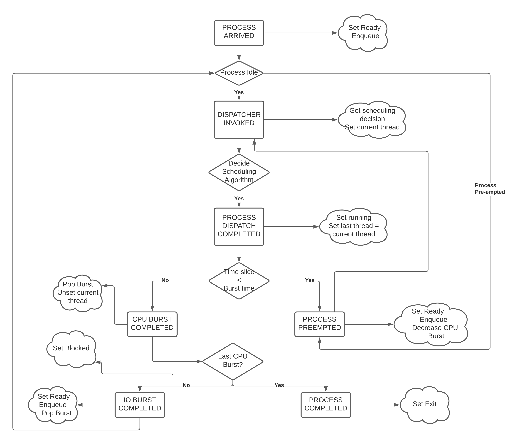

CSCI-442 - Fall'20: Project 4 - CPU Scheduling Simulator
========================================================

:Assigned: March 25, 2021
:Due: April 20, 2021, at 11:59 PM

Introduction
------------

The goal of this project is to develop a CPU scheduling simulation that will complete the execution of a group of multi-threaded processes.  
It will support several different scheduling algorithms.  The user can then specify which one to use via a command-line flag.  
At the end of execution, your program will calculate anddisplay several performance criteria obtained by the simulation.

Learning Objectives
~~~~~~~~~~~~~~~~~~~

- You will have better familiarity with one of the main roles of any operating system: process scheduling.
- You will become familiar with event-driven simulation.
- You will understand the performance implications of using different scheduling algorithms. In the future, you can reuse these concepts (scheduling, simulation, etc) in any optimization task you are given in your professional life.

This project must be implemented in C++, and it must execute correctly on Isengard.

1 Simulation Constraints
------------------------
The program will simulate process scheduling on a hypothetical computer system with the following attributes:

1. There is a single CPU, so only one process can be running at a time.
2. Processes consist of *exactly one* kernel-level thread 

   - I.e., each process is composed of a single thread of execution

3. Processes can exist in one of five states:

   - NEW
   - READY
   - RUNNING
   - BLOCKED
   - EXIT

4. Dispatching processes requires a non-zero amount of OS overhead

        * I.e., the time a context switch takes is required to be taken into account
        
6. Processes and dispatch overhead are specified via a file whose format is specified in the next section.
7. Each process requires a sequence of CPU and IO bursts of varying lengths as specified by an input file.
        
        * These bursts can be thought of as a process requiring a known amount of CPU time, followed by an I/O request that takes a known amount of time to complete

        * A process can have multiple CPU and I/O bursts as specified via the input file

8. Processes have an associated priority, specified as part of the file.

   - 0: SYSTEM (highest priority)
   - 1: INTERACTIVE
   - 2: NORMAL
   - 3: BATCH (lowest priority)

9. All processes have a distinct process ID, specified as part of the file.
10. Overhead is incurred only when dispatching a process (transitioning it from READY to RUNNING); all other OS actions require zero OS overhead. For example, adding a process to a ready queue is "free".
11. Processes can arrive at any time, even if some other process is currently running (i.e., some external entity—not the CPU—is responsible for creating processes).

2 Scheduling Algorithms
-----------------------
You scheduling simulator must support two different scheduling algorithms. These are as follows, with the corresponding flag value indicated in parenthesis:

- First Come, First Served (--algorithm FCFS)
- Round Robin (--algorithm RR)

2.1 First Come, First Served (FCFS)
~~~~~~~~~~~~~~~~~~~~~~~~~~~~~~~~~~~
First come, first served should be implemented as described in your textbook. That is to say, processes are scheduled in the order that they are added to the queue, and they run in the CPU until their burst is complete. There is not preemption in this algorithm, and all the process priorities are treated as equal.

2.2 Round Robin (RR)
~~~~~~~~~~~~~~~~~~~~
Round robin should be implemented as described in your textbook. That is to say, processes are scheduled in the order that they are added to the queue. However, unlike FCFS, processes may be preempted if their CPU burst length is greater than the round robin time slice. In the event of a preemption, the process is removed from the CPU and placed at the back of the ready queue. The CPU burst length is updated to reflect the time that it was able to spend on the CPU. All the process priorities are treated as equal.

The default time slice for the algorithm shall be 3, however, the user may input via command line flag a
custom time slice.

3 Next-Event Simulation
-----------------------
Your simulation structure must follow the next-event pattern. At any given time, the simulation is in a single state. The simulation state can only change at event times, where an event is defined as an occurrence that may change the state of the system.

Since the simulation state only changes at an event, the ”clock” can be advanced to the next scheduled event–regardless of whether the next event is 1 or 1,000,000 time units in the future. This is why it is called a ”next-event” simulation model. In our case, time is measured in simple ”units”. Your simulation must support the following event types:

- **PROCESS ARRIVED**: A process has been created in the system. 
- **PROCESS DISPATCH COMPLETED**: A process switch has completed, allowing a new process to start executing on the CPU. 
- **CPU BURST COMPLETED**: A process has finished one of its CPU bursts and has initiated an I/O request.
- **IO BURST COMPLETED**: A process' I/O request has completed.
- **PROCESS COMPLETED**: A process has finished the last of its CPU bursts.
- **PROCESS PREEMPTED**: A process has been preempted during execution of one of its CPU bursts.
- **DISPATCHER INVOKED**: The OS dispatcher routine has been invoked to determine the next process to be run on the CPU

The main loop of the simulation should consist of processing the next event, perhaps adding more future events in the queue as a result, advancing the clock (by taking the next scheduled event from the front of the event queue), and so on until all processes have terminated. See Figure 1 for an illustration of the event simulation. Rounded rectangles indicate functions that you will need to implement to handle the associated event types.

   
   Figure 1: A high level illustration of the next-event simulation. In the starter code, all of this functionality is to be implemented within the Simulation class. Rounded rectangles represent functions, while diamonds are decisions that lead to different actions being taken. For example, if the event type is determined to be THREAD ARRIVED, then the handle thread arrived(event) function should be called.

3.1 Event Queue
~~~~~~~~~~~~~~~
Events are scheduled via an event queue. The event queue is a priority queue that contains future events; the priority of each item in the queue corresponds to its scheduled time, where the event with the highest ”priority” (at the front of the queue) is the one that will happen next.

To determine the next event to handle, a priority queue is used to sort the events. For this project, the event queue should sort based on these criteria:

- The time the event occurs. The earliest time comes first (time 3 comes before time 12).
- If two events have the time, then the tie breaker should be the events’ number: as each new event is created, it should be assigned a number representing how many events have been created. For example, the first event in the simulation should be given the number 0, the second the number 1, and so on. The earliest number should come first (event number 6 comes before event number 7).

4 The Submission
----------------
You are required to submit the project by 23:59 on the due date, however you may take advantage of your slip days to turn the submission in late.

The project **must be submitted to Gradescope**. You will only have 3 submissions, and submission errors (e.g. compile error) *DO* count against that total. Thus it is **required** for you use our ``make_submission.sh`` script to create the ZIP file.

.. warning::

        Loss of any submissions due to failure to use the ``make_submission.sh`` script will **NOT** be given back.

4.1 Submission Objective
~~~~~~~~~~~~~~~~~~~~~~~~
Implement the entire process simulation. Using starter code is optional as long as your code passes the items in the checklist and tests given in Section 5.

4.2 Submission Checklist
~~~~~~~~~~~~~~~~~~~~~~~~
Please **MAKE SURE** you do all the following, prior to submission:

1. Your code compiles on Isengard: To compile your code, the grader should be to cd into the root directory of your repository and simply type make using the provided Makefile.
2. Your simulation should be able to be executed by typing ``./cpu-sim`` in the root directory of your repository.
3. You keep the ``Makefile``, the ``test-my-work.sh``, *and* ``make_submission.sh`` files, as well as the ``src/``, ``submission-details/``, and ``tests/`` folders from the starter code, in the root directory of your repository.
4. Your program parses input flags correctly, and outputs the correct information in response. See Sections 8 and 9.
5. Your program determines the file to parse from the command line.
6. You have the full simulation logic implemented.
7. The FCFS and RR algorithms are implemented.
8. All required metrics are displayed on program completion and match the user input flag choices.
9. Any improper command line input should cause your program to print the help message and then immediately exit.
10. Your code passes all the tests given in Section 5 on Isengard.   

5 Testing and Grading
---------------------
Grading for this project is dependent on your program’s ability to produce the correct output given a
simulation input file, so **it is vital that you follow all output formatting requirements**.

- The ``tests/`` folder in the starter code contains a number of input and output pairs that your simulation will be tested against. A piece of your grade will be based on the successful execution of the script below. The scripts runs your simulation for every input file in the ``tests/input/`` folder, and runs ``diff`` between the output of your simulation against the reference outputs under ``tests/output/`` folder.

        * If there is no difference (i.e., no output), your simulation ran as expected.

- The remaining piece of your grade will be based on the input files we will generate during grading. This is to make sure that you haven’t hard-coded the outputs in your simulation.

- You should expect your code to be evaluated based on how similar it is to the expected output by using a function such as diff. **Make sure that all debugging and other non-required print statements have been commented out before submitting your code.**
  
        - Both ``stdout`` and ``stderr`` will be captured, so ensure that nothing unexpected is going to be printed to either of these output streams. Logger functionality is provided with the starter code to help ensure that your program will output as expected by the grading scripts.

In order for you to easily test your simulation against the inputs and outputs under the tests/ folder, we have provided a bash script named ``test-my-work.sh`` in the root directory of your repository. You can run it by typing ``./test-my-work.sh`` (ensure it has execution permissions). For a specific, input/output/parameter combination, if the output of your simulation does not match the expected output, the testing will stop and give you more details. Otherwise, it will print a Test passed! message. We will use a similar script in our grading.

6 Getting Started
-----------------
Starter code has been provided for you to help you get started.

* The starter code contains complete code that implements logger functionality, a class called ``Logger``, so that you can easily print output in the correct format.
  
* The ``Simulation`` class has its functionality for reading and parsing the simulation file implemented for you, but you will need to implement the rest of the functionality for the next-event simulation.
  
* A number of other classes have also been provided, however you will need to implement many of them.

The starter code contains documentation to help you understand how these classes and their functionality should be implemented, so it is recommended that you read through the starter code carefully before starting to program. Follow the flow chart given above for guidance.

Included with the starter code is a string formatting library, fmtlib [#]_ . To use the string formatting library, you will need to ``#include "utilities/fmt/format.h"`` in your file. You can see an example of how to use the library within ``src/utilities/logger.cpp``. 

You are free to use the starter code and the libraries if you find them beneficial for implementing your project. You are not required to use any of the provided starter code, and as long as your program is implemented in
C++, runs on Isengard, does not crash, meets all specified requirements, and produces the correct output, you are free to design your program as you see fit.

The starter code includes a ``Makefile`` that builds everything under the ``src/`` directory, placing temporary files in a ``bin/`` directory and the program itself, named ``cpu-sim``, in the root of the repository. Do not make changes to the ``Makefile`` without prior approval by the instructors.

Chapter 9 in your textbook describes uniprocessor scheduling, and provides good background information on what you are trying to implement. It also provides a number of diagrams that you may find helpful for understanding how processes should be between states (for example, Figure 9.1).

7 Simulation File Format
------------------------
The simulation file specifies a complete specification of scheduling scenario. It’s format is as follows:

.. code-block::

   num_processes 0 process_switch_overhead
   
   process_id process_type 1              // Process IDs are unique
   process_arrival_time num_cpu_bursts
   cpu_time io_time
   cpu_time io_time
   ...                                    // Repeat for num_cpu_bursts
   cpu_time

   process_id process_type 1              // We are now reading in the next process
   process_arrival_time num_cpu_bursts
   cpu_time io_time
   
   cpu_time io_time
   ...                                    // Repeat for num_cpu_bursts
   cpu_time
   
   ...                                    // Keep reading until EOF is reached
   
Here is a commented example. The comments will not be in an actual simulation file.

.. code-block:: 

   2 0 7    // 2 processes, process overhead is 7
   
   0 1 1    // Process 0, Priority is INTERACTIVE
   0 3      // The process arrives at time 0 and has 3 bursts
   4 5      // The first pair of bursts : CPU is 4, IO is 5
   3 6      // The second pair of bursts : CPU is 3, IO is 6
   1        // The last CPU burst has a length of 1

   1 0 1    // Process 1, priority is SYSTEM
   5 3      // The process arrives at time 5 and has 3 bursts
   4 1      // The first pair of bursts : CPU is 4, IO is 1
   2 2      // The second pair of bursts : CPU is 2, IO is 2
   2        // The last CPU burst has a length of 2
   
8 Command Line Parsing
----------------------

Your simulation must support invocation in the format specified below, including the following command line flags:

.. code-block:: 

   ./cpu-sim [flags] [simulation_file]
   
   -h, --help
      Print a help message on how to use the program.
      
   -m, --metrics
      If set, output general metrics for the simulation.
      
   -s, --time_slice [positive integer]
      The time slice for preemptive algorithms.
      
   -t, --per_thread
      If set, outputs per-thread metrics at the end of the simulation.
      
   -v, --verbose
      If set, outputs all state transitions and scheduling choices.
      
   -a, --algorithm <algorithm>
      The scheduling algorithm to use. Valid values are:
         FCFS: first come, first served (default)
         RR: round robin scheduling
         
Users should be able to pass any flags together, in any order, provided that:

- If the ``--help`` flag is set, a help message is printed to ``stdout`` and the program immediately exits.
- If ``--time_slice`` is set, it must be followed immediately by a positive integer.
- If ``--algorithm`` is set, it must be followed immediately by an algorithm choice.
- If ``--algorithm`` is not set, your program shall default to using first come, first served as its scheduling algorithm.
- If a filename is not provided, the program shall read in from ``stdin``.

Any improper command line input should cause your program to print the help message and then immediately exit. Information on proper output formatting can be found in Section 9.

You are strongly encouraged to use the getopt family of functions to perform the command line parsing. Information on getopt can be found here: http://man7.org/linux/man-pages/man3/getopt.3.html

9 Output Formatting
-------------------
For efficient and fair grading, it is vital that your simulation outputs information in a well-defined way. The starter code provides functionality for printing information, and it is strongly encouraged that you use it. The information that your simulation prints is dependent on the flags that the user has input, and in the following sections we describe what should be printed for each flag.

9.1 No flags input
~~~~~~~~~~~~~~~~~~
If the user has not input any flags to your program, you should only output the following:

``SIMULATION COMPLETED!``

9.2 --metrics
~~~~~~~~~~~~~
When the metrics flag has been passed to your simulation, it should output the following information:

.. code-block::
   
   SIMULATION COMPLETED !

   SYSTEM THREADS :
      Total Count : 3
      Avg . response time : 23.33
      Avg . turnaround time : 94.67
   
   INTERACTIVE THREADS :
      Total Count : 2
      Avg . response time : 10.00
      Avg . turnaround time : 73.50

   NORMAL THREADS :
      Total Count : 0
      Avg . response time : 0.00
      Avg . turnaround time : 0.00

   BATCH THREADS :
      Total Count : 0
      Avg . response time : 0.00
      Avg . turnaround time : 0.00

   Total elapsed time : 130
   Total service time : 53
   Total I/O time : 34
   Total dispatch time : 69
   Total idle time : 8

   CPU utilization : 93.85%
   CPU efficiency : 40.77%

9.3 --per thread
~~~~~~~~~~~~~~~~
When the per thread flag has been passed to your simulation, it should output information about each of the threads.

.. code-block::

   SIMULATION COMPLETED !

   Process 0 [INTERACTIVE]:
      Thread   0:    ARR : 0      CPU : 8     I/O: 11     TRT: 88        END: 88
      Thread   1:    ARR : 1      CPU : 9     I/O: 2      TRT: 59        END: 60

   Process 1 [SYSTEM]:
      Thread   0:    ARR : 5      CPU : 8     I/O: 3      TRT : 92       END: 97
      Thread   1:    ARR : 6      CPU : 5     I/O: 2      TRT : 69       END: 75
      Thread   2:    ARR : 7      CPU : 23    I/O: 16     TRT : 123      END: 130
   
9.4 --verbose
~~~~~~~~~~~~~
When the verbose flag has been passed to your simulation, it should output, at each state transition, information about the state transition that is occurring. It should be outputting this information ”on the fly”.

.. code-block::

   At time 0:
      THREAD_ARRIVED
      Thread 0 in process 0 [INTERACTIVE]
      Transitioned from NEW to READY

   At time 0:
      DISPATCHER_INVOKED
      Thread 0 in process 0 [INTERACTIVE]
      Selected from 1 threads . Will run to completion of burst.
      
This continues until the end of the simulation:

.. code-block::

   At time 127:
      THREAD_DISPATCH_COMPLETED
      Thread 2 in process 1 [ SYSTEM ]
      Transitioned from READY to RUNNING

   At time 130:
      THREAD_COMPLETED
      Thread 2 in process 1 [ SYSTEM ]
      Transitioned from RUNNING to EXIT

   SIMULATION COMPLETED !

9.5 Multiple Flags
~~~~~~~~~~~~~~~~~~
If multiple flags are input, all should be printed, in this order:

1. The verbose information.
2. ``SIMULATION COMPLETED!``
3. Per thread metrics.
4. General simulation metrics.

9.6 Recommendations
~~~~~~~~~~~~~~~~~~~
Again, it is highly recommended that you take advantage of the existing logger functionality!

10 Collaboration Policy
-----------------------

This is an **individual project**.  All code you submit should be
written by yourself.  You should not share your code with others.

Please see the syllabus for the full collaboration policy.

.. warning::

   **Plagarism will be punished harshly!**

11 Access to Isengard
---------------------

Remote access to Isengard is quite similar to ALAMODE, but the
hostname is ``isengard.mines.edu``.

For example, to ``ssh`` into the machine with your campus MultiPass
login, use this command::

  $ ssh username@isengard.mines.edu

Note: you need to be on the campus network or VPN for this to work.
If you are working from home, use either the VPN or hop thru
``imagine.mines.edu`` first.

Appendices
==========

A Example Simulation Input
--------------------------

.. code-block::

   1 3 7

   0 1 1
   0 3
   4 5
   3 6
   1

B Example Simulation Output
---------------------------
For the input above, this was the output:

.. code-block::

   At time 0:
      THREAD_ARRIVED
      Thread 0 in process 0 [INTERACTIVE]
      Transitioned from NEW to READY

   At time 0:
      DISPATCHER_INVOKED
      Thread 0 in process 0 [INTERACTIVE]
      Selected from 1 threads. Will run to completion of burst.

   At time 7:
      PROCESS_DISPATCH_COMPLETED
      Thread 0 in process 0 [INTERACTIVE]
      Transitioned from READY to RUNNING

   At time 11:
      CPU_BURST_COMPLETED
      Thread 0 in process 0 [INTERACTIVE]
      Transitioned from RUNNING to BLOCKED

   At time 16:
      IO_BURST_COMPLETED
      Thread 0 in process 0 [INTERACTIVE]
      Transitioned from BLOCKED to READY

   At time 16:
      DISPATCHER_INVOKED
      Thread 0 in process 0 [INTERACTIVE]
      Selected from 1 threads. Will run to completion of burst.

   At time 19:
      THREAD_DISPATCH_COMPLETED
      Thread 0 in process 0 [INTERACTIVE]
      Transitioned from READY to RUNNING

   At time 22:
      CPU_BURST_COMPLETED
      Thread 0 in process 0 [INTERACTIVE]
      Transitioned from RUNNING to BLOCKED

   At time 28:
      IO_BURST_COMPLETED
      Thread 0 in process 0 [INTERACTIVE]
      Transitioned from BLOCKED to READY

   At time 28:
      DISPATCHER_INVOKED
      Thread 0 in process 0 [INTERACTIVE]
      Selected from 1 threads. Will run to completion of burst.

   At time 31:
      THREAD_DISPATCH_COMPLETED
      Thread 0 in process 0 [INTERACTIVE]
      Transitioned from READY to RUNNING

   At time 32:
      THREAD_COMPLETED
      Thread 0 in process 0 [INTERACTIVE]
      Transitioned from RUNNING to EXIT

   SIMULATION COMPLETED !
   
   Process 0 [INTERACTIVE]:
      Thread 0:   ARR : 0  CPU : 8   I/O: 11    TRT : 32    END : 32

   SYSTEM THREADS:
      Total Count:                0
      Avg. response time:      0.00
      Avg. turnaround time:    0.00

   INTERACTIVE THREADS:
      Total Count: 1
      Avg. response time:      7.00
      Avg. turnaround time:   32.00

   NORMAL THREADS:
      Total Count :               0
      Avg. response time:      0.00
      Avg. turnaround time:    0.00

   BATCH THREADS:
      Total Count:                0
      Avg. response time:      0.00
      Avg. turnaround time:    0.00

   Total elapsed time:           32
   Total service time:            8
   Total I/O time:               11
   Total dispatch time:          13

   Total idle time:              11

   CPU utilization:          65.62%
   CPU efficiency:           25.00%
   
   
.. [#] https://github.com/fmtlib/fmt
